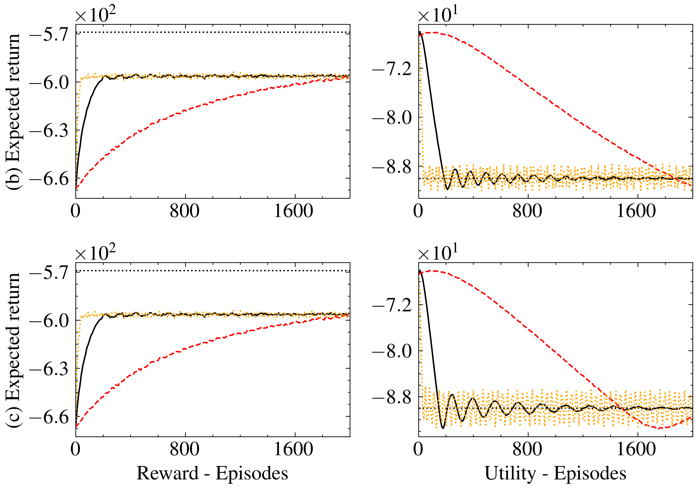

# Deterministic Policy Gradient Primal-Dual Methods for Continuous-Space Constrained MDPs

by
Sergio Rozada,
Dongsheng Ding,
Antonio G. Marques,
and Alejandro Ribeiro

This code belongs to a paper that has been published in *AAAI Conference on Artificial Intelligence 2025*.

## TLDR

> The associated paper presents a methodology to search for optimal deterministic policies in continuous constrained state-action spaces. This repository contains the code that replicates the simulations presented in the paper. 

    

## Abstract

> We study the problem of computing deterministic optimal policies for constrained Markov decision processes (MDPs) with continuous state and action spaces, which are widely encountered in constrained dynamical systems. Designing deterministic policy gradient methods in continuous state and action spaces is particularly challenging due to the lack of enumerable state-action pairs and the adoption of deterministic policies, hindering the application of existing policy gradient methods for constrained MDPs. To this end, we develop a deterministic policy gradient primal-dual method to find an optimal deterministic policy with non-asymptotic convergence. Specifically, we leverage regularization of the Lagrangian of the constrained MDP to propose a deterministic policy gradient primal-dual (D-PGPD) algorithm that updates the deterministic policy via a quadratic-regularized gradient ascent step and the dual variable via a quadratic-regularized gradient descent step. We prove that the primal-dual iterates of D-PGPD converge at a sub-linear rate to an optimal regularized primal-dual pair. We instantiate D-PGPD with function approximation and prove that the primal-dual iterates of D-PGPD converge at a sub-linear rate to an optimal regularized primal-dual pair, up to a function approximation error. Furthermore, we demonstrate the effectiveness of our method in two continuous control problems: robot navigation and fluid control. To the best of our knowledge, this appears to be the first work that proposes a deterministic policy search method for continuous-space constrained MDPs.

## Software implementation

All source code used to generate the results and figures in the paper are in the `src` folder. The calculations and figure generation are all done by running the notebooks:
* `EXP1_nav_quadratic.ipynb`: Navigation problem with quadratic constraints.
* `EXP2_nav_absolute.ipynb`: Navigation problem with absolute-valued constraints.
* `EXP3_nav_zone.ipynb`: Navigation problem with area restriction.
* `EXP4_fluid.ipynb`: Fluid velocity control problem.
* `par_exp_2_nav_absolute.py`: Code to run sample-based implementation in parallel for navigation with absolute-valued constraints.
* `par_exp_3_nav_zone.py`: Code to run sample-based implementation in parallel for navigation with area restriction.
* `par_exp_4_fluid.py`: Code to run sample-based implementation in parallel for fluid control.
* `PLOTS.ipynb`: Code to replicate the figures of the paper.

Results generated by the code are saved in `results`, and figures are saved in `figures`.

## Getting the code

You can download a copy of all the files in this repository by cloning the
[git](https://github.com/sergiorozada12/d-pg-pd) repository:

    git clone https://github.com/sergiorozada12/d-pg-pd.git

or [download a zip archive](https://github.com/sergiorozada12/d-pg-pd/archive/refs/heads/main.zip).

## Dependencies

You'll need a working Python environment to run the code.
The recommended way to set up your environment is through [virtual environments](https://docs.python.org/3/library/venv.html). The required dependencies are specified in the file `requirements.txt`.
